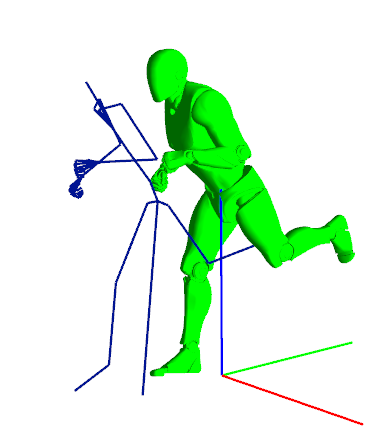

# Animation Programming (Skeletal Animation)

## What is this project about ?
This project is a school project made in 10 days during my studies at ISART Digital. My goals for this project are:
- Learning how 3D animation (Skeletal animation in particular) can get implemented in a game engine
- Understanding how to compute a 3D Animation using the CPU and the GPU (Hardware skinning)

## Software used
- Visual Studio 2019-2022 to code

## Libraries used
- WhiteBoxEngine (3D Engine made by a professor at ISART Digital: https://github.com/Trizek/WhiteBoxEngine)
- LibMaths (My own Mathematic library)

## How to build ?
The build isn't included in this repository. To build this project, the best and easiest way is to use Visual Studio 2019-2022. All you have to do is to build in any configuration you want (Debug/Release) but for 32 bits platform exclusively (Due to WhiteBoxEngine compatibility).

## WARNING (Undefined behavior may occur)
The application is unstable and sometimes the model won't show up. All you have to do is to close the application and re-open it again. This error is due to resources parsing and comes from the version of WhiteBoxEngine I used.